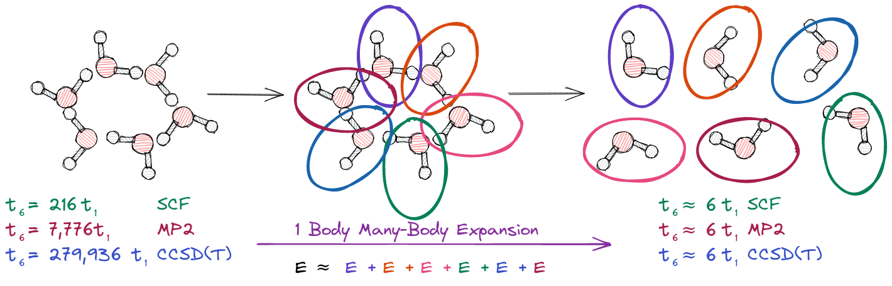
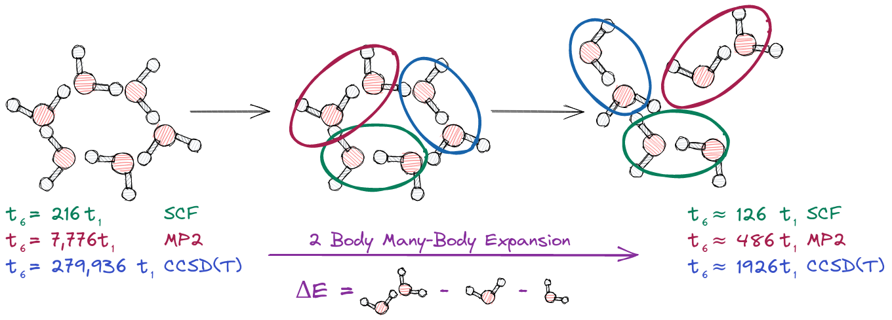

######################
Fragment Based Methods
######################

Fragment-based methods are a series of reduced-scaling quantum chemistry 
approximations which rely on the near-sighted nature of electronic matter to
circumvent the highly non-linear scaling of traditional electronic structure
methods. This page is meant as a non-rigorous introduction to the concept.
Other sections in this documentation present the methods in a more rigorous
manner. 

.. |n|  replace:: :math:`N`
.. |n3| replace:: :math:`\mathcal{O}\left(N^3\right)`
.. |n5| replace:: :math:`\mathcal{O}\left(N^5\right)`
.. |n7| replace:: :math:`\mathcal{O}\left(N^7\right)`
.. |t1| replace:: :math:`t_1`
.. |t6| replace:: :math:`t_6`

***********
The Problem
***********

.. _fig_hexamer_1b:

   Left. If |t1| is the time it takes to compute the energy of a single water
   molecule, then |t6| is the time required to compute the energy of water
   hexamer. Middle. In a 1-body many-body expansion (MBE), we approximate the 
   energy of water hexamer as the sum of the energies of each water molecule. 
   Right. The 1-body MBE approximation is dramatically cheaper to compute than
   the energy of the water hexamer.   

The goal of quantum chemistry is to be able to predict and explain 
computational phenomenona using rigorous physical models that contain little
to no emperical parameters. Unfortunately quantum chemistry methods exhibit
steep computational scaling with respect to system size, |n|. For example most 
modern self-consistent field (SCF) methods (*e.g.*, Hartree-Fock or density
functional theory) exhibit |n3| scaling, which is to say that the time to
solution for SCF methods increases cubically with respect to |n|.

To better understand computational complexity, assume that for a particular 
quantum chemistry method |t1| is the time to solution for computing the energy 
of a single water molecule. The left side of :numref:`fig_hexamer_1b` shows how
the time to solution for computing the energy of water hexamer, |t6|, compares
to |t1|, for three quantum chemistry methods. For the purposes of 
:numref:`fig_hexamer_1b` we assume that SCF scales as |n3|, second-order
Moller-Plesset perturbation theory (MP2) scales as |n5|, and coupled cluster
with single, double, and perturbative triple excitations, CCSD(T), scales as
|n7|. For SCF, this means that :math:`t_6 = 6^3 t_1 =216 t_1`. That is to say,
an SCF calculation on water hexamer will take 216 times longer than an SCF
calculation on a single water molecule. The situation is markedly worse for
CCSD(T) where we expect computing the energy of water hexamer to be 279,936 
times longer than computing the energy of a single water molecule.

***********
A solution?
***********

While the exact electronic Hamiltonian is a pair-wise operator, for a given
basis set the exact electron wavefunction has contributions arising from all 
possible excitations out of a reference state. In practice, excitations tend
to contribute more to the wavefunction if the orbitals involved in the 
excitation are spatially local to one another. Thus, to reduce the scaling of
an electronic structure method, one may somehow restrict the set of excitations
considered to spatially local sets. 

Conceptually one of the easiest ways to establish local sets is to fragment a
molecule. In the full water hexamer calculation shown on the left side 
:numref:`fig_hexamer_1b` each electron can see each orbital. The middle panel
of :numref:`fig_hexamer_1b` suggests that we instead treat water hexamer as six
separate water molecules. By separate we mean the electrons in each water
molecule can now only see the orbitals associated with that water molecule. In
practice, this is somewhat trivial to implement, as it just amounts to running 
six individual calculations (one for each water molecule). As shown on the 
right side of :numref:`fig_hexamer_1b`, by fragmenting water hexamer, we can 
approximate the energy of the water hexamer at a cost of six times |t1|. Even
for SCF this represents a reduction of two orders of magnitude in the time to
solution; the savings are even more remarkable for high-accuracy CCSD(T) which
sees a reduction in time of five orders of magnitude!

The approximation just described is known as a one-body method because the
target system is broken up into fragments and those fragments are not allowed
to interact with one another. As this description suggests the one-body
approximation is usually not particularly accurate on account of neglecting the
interactions among the various fragments. Unfortunately, for most use cases, a 
reduction in computational cost is only useful if the corresponding 
approximation is sufficiently accurate, and one-body fragment-based methods
are rarely of interest.

*****************************
The many-body expansion (MBE)
*****************************

.. |I| replace:: :math:`I`
.. |J| replace:: :math:`J`
.. |IJ| replace:: :math:`IJ`

.. _fig_hexamer_2b:

   Left. Time to solution |t6| for water hexamer as a multiple of the time to
   solution for a single water molecule at the same level of theory |t1|.
   Middle. Three of the 15 possible dimers. Right. The time to solution for
   the two-body approximation.

As discussed at the end of the previous section, a one-body approximation is
an insufficiently accurate approximation to energy of the target system on
account of neglecting many-body interactions. Of the neglected interactions,
the most important are the pair-wise interactions among the fragments, *i.e.*,
the two-body interactions.

Most fragment-based methods compute two-body interactions via a supersystem
approach. Let |IJ| be the system formed from the union of fragments |I| and |J|,
then using a supersystem approach we can compute the two-body interaction
between |I| and |J| by computing the energy of |IJ| and subtracting from it
the sum of the energies of |I| and |J|. Put another way, we remove the one-body
contributions to the energy of |IJ| and what remains must be the two-body
interaction. This is pictorially shown in the center of 
:numref:`fig_hexamer_2b`.

For water hexamer there is 6 choose 2, or 15, dimers (a dimer being a pair of
fragments). Each pair of water molecules, or dimer, represents a system which 
is two times larger than a single fragment. Thus at the SCF level of theory, 
for example, the time to compute the energy of a dimer is :math:`2^3t_1=8t_1`.
Since there are 6 fragments and 15 dimers involved in approximating the energy 
of the hexamer, the total time to approximate the energy of the water hexamer
is now 126|t_1|. 

While at the SCF level of theory the two-body approximation is two orders of 
magnitude more expensive than the one-body approximation, the resulting 
approximate energy is much better. Furthermore, the 15 dimer, and 6 monomer,
calculations represent 21 separate calculations, which can easily be 
parallelized. Thus with access to sufficient parallel resources, at the SCF
level of theory, the time for the two-body approximation can be reduced to
:math:`8t_1` with little trouble. 

While the two-body approximation tends to be more accurate than the one-body
approximation, for high-accuracy work the two-body approximation tends to still
be insufficient. Using the supersystem method it is straightforward to
compute three-body interactions by taking unions of three fragments, computing
the energy, and then subtracting from that energy the two- and one-body
contributions. The result is a three-body method. The superystem method can be
extended to computing four-, five-, and six-body interactions. The resulting
equation represents a formally exact energy expansion of the hexamer's energy
known as the many-body expansion (MBE). The MBE (and the closely related
generalized MBE) is at the heart of all fragment-based methods.

