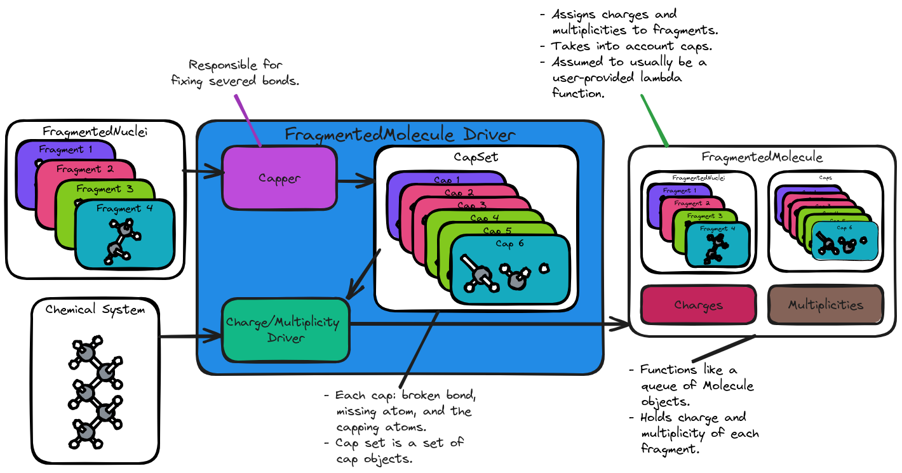

.. _gf_designing_fragmented_molecule_driver:

#######################################
Designing the FragmentedMolecule Driver
#######################################

This page captures the design process of the ``FragmentedMolecule`` driver
component of GhostFragment.

**************************************
What is the FragmentedMolecule Driver?
**************************************

The first step of the :ref:`gf_fragmented_system_driver_design` required
creating a ``FragmentedMolecule`` object. The responsibility for creating that
object was punted to the ``FragmentedMolecule`` driver. The 
``FragmentedMolecule`` driver is responsible for taking a ``Molecule`` as
input and returning a ``FragmentedMolecule`` object.

****************************************
FragmentedMolecule Driver Considerations
****************************************

Accuracy
   :ref:`gf_fragmented_system_driver_design` punted most of the responsibility 
   for ensuring the set of fragments captures all important interactions to
   the ``FragmentedMolecule`` driver. At this stage this primarily will entail
   ensuring that severed bonds are dealt with correctly.

.. _fmd_hierarchical:

Hierarchical
   Like the ``FragmentedSystem`` driver we again want the ``FragmentedMolecule``
   driver to be designed in a hierchical manner that mirrors the hierarchy of
   the ``ChemicalSystem`` and ``FragmentedSystem`` classes. For the 
   ``FragmentedMolecule`` driver this means calling a ``FragmentedNuclei``
   driver.

.. _fmd_capping:

Capping
   Severing a covalent bond leads to very large perturbations. The severed
   bond must be dealt with in some manner. 

   - Capping must be done before charges/multiplicities can be assigned.

.. _fmd_charge_mult:

Charge and multiplicity
   Relative to the ``Nuclei`` class the ``Molecule`` class adds the charge and
   multiplicity. The ``FragmentedMolecule`` class is similar in that it adds
   to the ``FragmentedNuclei`` class a set of charges and multiplicities,
   namely the charge and multiplicity of each fragment.

********************************
FragmentedMolecule Driver Design
********************************

.. _fig_gf_fragmented_molecule_driver:

   The architecture of the ``FragmentedMolecule`` Driver. 