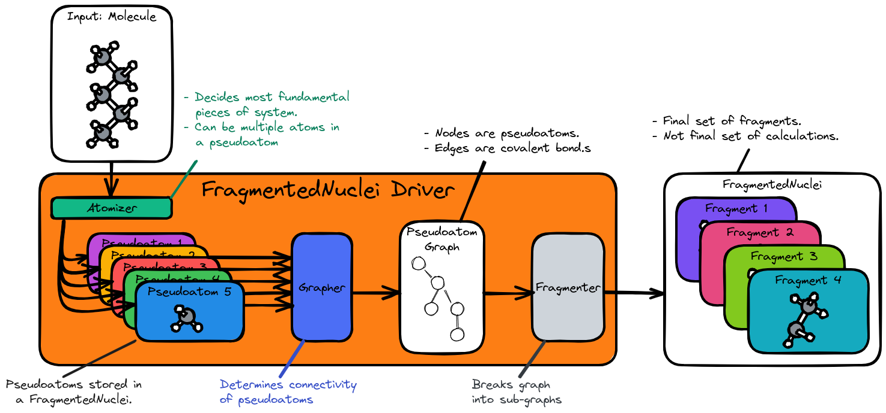

.. Copyright 2024 GhostFragment
..
.. Licensed under the Apache License, Version 2.0 (the "License");
.. you may not use this file except in compliance with the License.
.. You may obtain a copy of the License at
..
.. http://www.apache.org/licenses/LICENSE-2.0
..
.. Unless required by applicable law or agreed to in writing, software
.. distributed under the License is distributed on an "AS IS" BASIS,
.. WITHOUT WARRANTIES OR CONDITIONS OF ANY KIND, either express or implied.
.. See the License for the specific language governing permissions and
.. limitations under the License.

.. _gf_fragmented_nuclei_driver_design:

##################################################
Designing GhostFragment's FragmentedNuclei Driver
##################################################

************************************
What is the FragmentedNuclei Driver?
************************************

The ``FragmentedNuclei`` driver is responsible for dividing the nuclei of a
molecular system into fragments. The resulting fragments will then be further
processed by the ``FragmentedMolecule`` driver.

**************************************
FragmentedNuclei Driver Considerations
**************************************

.. _fnd_hierarchy_base:

Hierarchy base
   The ``FragmentedNuclei`` driver is assumed to be the base driver of 
   the ``FragmentedNuclei``, ``FragmentedMolecule``, and ``FragmentedSystem``
   hierarchy.

.. _fnd_psudoatoms:

Pseudoatoms
   As the base of the hierarchy, the ``FragmentedNuclei`` driver's first task
   is to determine the set of :ref:`pseudoatom` s which will be used to form
   fragments.

.. _fnd_connectivity:

Connectivity
   The majority of fragmentation algorithms need not just a set of pseudoatoms,
   but also the connectivity of those pseudoatoms.

.. _fnd_generality:

Generality
   The ``FragmentedNuclei`` driver is envisioned as being the piece which needs
   to vary the most among existing fragment methods. Many existing fragment-
   based methods differ only in how the initial fragments are formed.

.. _fnd_chemical_system:

Chemical system input
   While it may seem logical to take a ``Nuclei`` object as the input, by 
   taking a ``ChemicalSystem`` we open up the possibility for the 
   ``FragmentedNuclei`` driver to use additional information to choose the
   ``Nuclei`` sets. For example, using the charge could be helpful for assigning
   connectivity, and for prescreening fragments based on energetic 
   contributions.

   - Put another way, the ``FragmentedNuclei`` chosen by the driver need to be
     representative of the system being fragmented. This requires the driver to
     have knowledge of the entire system, not just the nuclei.
   - Since a ``ChemicalSystem`` contains a ``Nuclei`` object, drivers which do
     not need additional information are free to ignore the extra state.

.. _fnd_nmers:

n-mers
   From the perspective of the rest of GhostFragment, there is no difference
   between an n-mer and a fragment. In order to encapsultate the detail of 
   whether GhostFragment is dealing with n-mers vs. fragments we want the 
   ``FragmentedNuclei`` driver to have the same API as the n-mer driver.

******************************
FragmentedNuclei Driver Design
******************************

.. _fig_gf_fragmented_nuclei_driver:

   The architecture of the ``FragmentedNuclei`` Driver. 

:numref:`fig_gf_fragmented_nuclei_driver` shows the main pieces of the
``FragmentedNuclei`` driver. Following from consideration :ref:`fnd_psudoatoms`,
the first step is the creation of "pseudoatoms" by the ``Atomizer`` component. 
As suggested by :numref:`fig_gf_fragmented_nuclei_driver`, the ``Atomizer``
actually satisfies the same property type as the driver, which in turn allows
the pseudoatoms to be used as bona fide fragments. Regardless of exactly how
the pseudoatoms are chosen, the ``Atomizer`` ultimately defines the smallest 
units for the fragmentation algorithm. 

With the pseduoatoms established, the next consideration is
:ref:`fnd_connectivity`, *i.e.*, determining which pseudoatoms are bonded to
eachother. The pseudoatoms plus the connectivity establishes a molecular graph.
It is this moleculer graph which is ultimately decomposed by the ``Fragmenter``
module. The ``Fragmenter`` module is responsible for addressing the
:ref:`fnd_generality` consideration; in particular it is the ``Fragmenter``
module which will usually be substituted out to change how fragments are formed.

