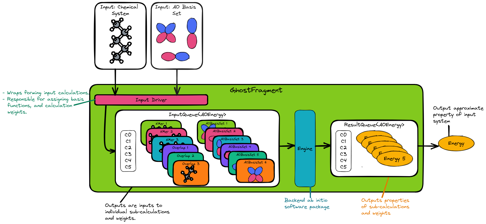

#############################
GhostFragment Design Overview
#############################

The purpose of this page is to provide a quick, high-level overview of the 
design of GhostFragment and to point the interested reader to where they
may find more details.

**********************
What is GhostFragment?
**********************

GhostFragment is a software package designed to facilitate developing and
running fragment-based methods. It is now known that to use fragment-based
methods to accurately approximate traditional methods one must also account
for basis-set superposition error. GhostFragment also includes functionality to
correct for basis-set superposition error.

*****************************
Why do we need GhostFragment?
*****************************

There is no one-stop shop for fragment-based methods. Various electronic
structure packages have implementations of one or a few methods, but no
package readily provides acccess to a large number of methods. GhostFragment
seeks to change this while also facilitating rapid-prototyping of new methods.

****************************
GhostFragment Considerations
****************************

Performance
   Fragment-based methods are meant to be an approximation to traditional
   electronic structure methods. Most traditional methods have highly-performant
   implementations. To be useful, fragment-based methods should improve the
   applicability of traditional methods. This can only be done if the 
   implementations of the fragment-based methods are accurate and also
   performant.

Accuracy
   Brought up in the performance consideration, general applicability of
   fragment-based methods requires the resulting approximation to be accurate.

Generality.
   We want GhostFragment to be able to house as many fragment-based methods as
   possible. This requires having an overall architecture which is as applicable
   as possible.

Covalent systems.
   GhostFragment should be applicable to not just clusters, but also large
   covalently-bonded systems as well.

Non-disjoint.
   Early fragment-based methods assumed that fragments were disjoint. We do
   not want to restrict ourselves to only disjoint fragments.

Multi-layer.
   A promising variation on a traditional fragment-based method is to treat
   part of the chemical system with one level of theory, and the rest with
   another (in theory this can easily be extended to more than two levels,
   but in practice is often limited to two).

***********************
Design of GhostFragment
***********************

This section presents a top-down view of GhostFragment. Starting with the
overall architcture.

Architecture Overview
=====================

Link to full discussion: :ref:`gf_architecture`.

.. _fig_gf_arch:

   
   GhostFragment is comprised of two components: an input driver, and an
   engine.

:numref:`fig_gf_arch` shows the high-level architecture of GhostFragment. The
unifying theme of all fragment-methods is that they strive to approximate one
large computation via a series of smaller computations. How one maps the 
target system to sub-computations is handled by the "input driver"
component. Once we know the inputs for the smaller computations the "Engine"
is used to run the smaller computations. Given the results of the smaller
computations, GhostFragment can then approximate the property of interest for 
the larger system.

Input Driver Overview
=====================

.. |n| replace:: :math:`n`

Link to full discussion :ref:`gf_input_driver_design`.

.. _fig_gf_input_driver:

.. figure:: assets/input_driver.png
   :align: center

   Illustration of the three main steps of the input driver: 
   ``FragmentedSystem`` formation,  |n|-mer formation, and determination of the
   final set of inputs.

:numref:`fig_gf_input_driver` shows an overview of how an input chemical 
system (*i.e.*, the input of the large calculatoin) is mapped to a series of
smaller sub-calculations. The first step is to divide the input system
into members of a ``FragmentedSystem``; this is the responsibility of the
``FragmentedSystem`` Driver. The fragments that emerge from 
the ``FragmentedSystem`` driver are assumed to be the final set of subsysetms,
*i.e.*, they may actually be |n|-mers. The "Interaction Driver" is responsible 
for determining what sub-calculations are necessary, what weights those
calculations should have, and assigning the AO basis sets to each sub-
calculation.

Fragmented System Driver
========================

Link to full discussion :ref:`gf_fragmented_system_driver_design`.

.. _fig_gf_fragmented_system_driver:

.. figure:: assets/fragmented_system_driver.png
   :align: center

   The three major components of the ``FragmentedSystem`` driver include: the
   "fragment driver", the "Charge/Multiplicity driver", and the "field driver".

:numref:`fig_gf_fragmented_system_driver` shows an overview of how the input
chemical system is broken into fragments. The first step is to create subsets of
nuclei from the nuclei of the original system via a ``FragmentDriver`` module.
Then a "Charge/Mult" driver assigns charges and multiplicites to each of the 
fragments resulting in a series of molecules stored in a ``FragmentedMolecule``
object. From their the ``FieldDriver`` assigns fields to each of the molecules
in the ``FragmentedMolecule`` resulting in the ``FragmentedSystem`` object.

Fragment Driver
===============

Link to the full discussion :ref:`gf_fragment_driver`.

.. figure:: assets/fragment_driver.png
   :align: center

   The major components of the ``FragmentDriver`` are the ``Atomizer``, the
   ``Grapher``, and the ``Fragmenter``.

:numref:`fig_gf_fragment_driver` shows an overview of the ``FragmentDriver`` 
which is responsible for breaking the input chemical system into fragments. To
do this the ``Atomizer`` first breaks the input chemical system
into pseudoatoms, *i.e.*, the most fundamental units of the chemical system.
From this point everything is expressed in terms of pseudoatoms. Next, the
connectivity of the pseudoatoms is assessed by the ``Grapher`` module. The
result is a connectivity table for the pseudoatoms. Finally, the ``Fragmenter``
module breaks the graph into subgraphs, each of which is a set of nuclei. 